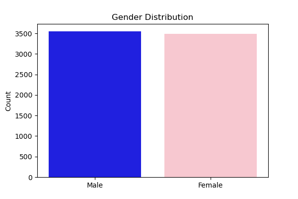
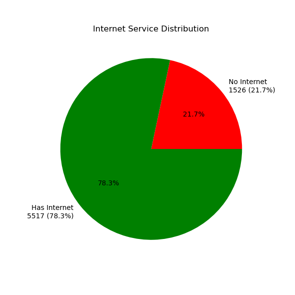
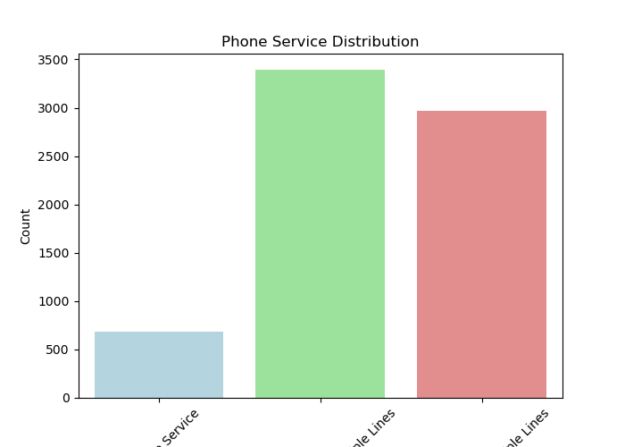
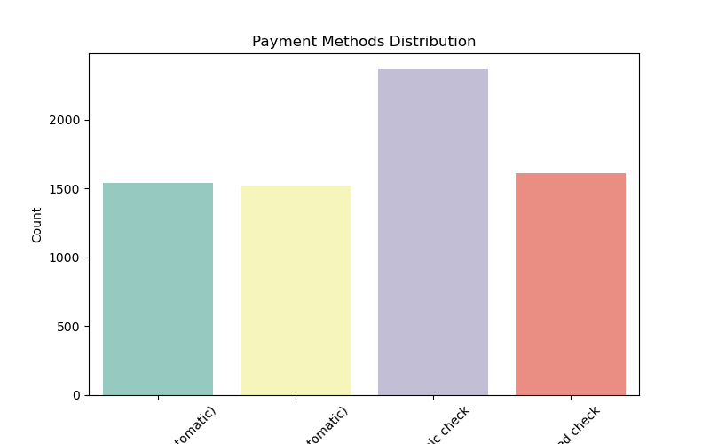
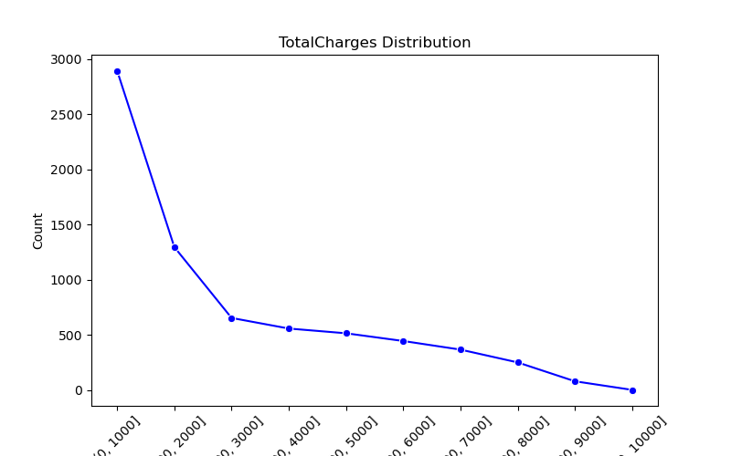

# Data Analysis Using Python - Customer Churn

## Project Overview
This project performs a comprehensive **data analysis** on a customer churn dataset using **Python**.  
It includes data cleaning, preprocessing, exploratory data analysis (EDA), and visualizations to uncover patterns and insights related to customer churn.

## Technologies & Packages Used
- Python 3.x  
- `pandas`  
- `numpy`  
- `matplotlib`  
- `seaborn`  
- `scikit-learn`  

## Features

### 1. Data Cleaning
- Imputation of missing values using `SimpleImputer`  
- Conversion of numeric and categorical variables  

### 2. Exploratory Data Analysis (EDA)
- Gender distribution  
- Senior citizen analysis  
- Internet and phone service analysis  
- Payment method analysis  
- Total charges distribution  

### 3. Visualizations
All plots are saved in the `plots/` folder and embedded below for quick preview.

#### Gender Distribution


#### Senior Citizen Distribution by Gender


#### Internet Service Distribution


#### Phone Service Distribution


#### Payment Methods Distribution


#### Total Charges Distribution


## Outputs
- **Cleaned dataset:** `customerchurn_cleaned.csv`  
- **All visualizations:** saved in `plots/` folder  

## File Structure
- `customer_churn1.csv`  
- `customerchurn_cleaned.csv`  
- `mohantynaanee.py`  
- `README.md`  
- `plots/` (folder containing all generated graphs)  

## How to Run
1. Open **Anaconda Prompt** or your preferred terminal.  
2. Navigate to the project folder:
```bash
cd "C:\Users\aditya\3D Objects\Data-Analysis-Customer-Churn-Python"
